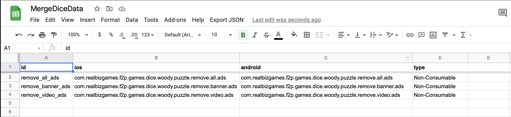

# realbizgames-masterdata-iap

Goals:
1. Can use it directly without writing any the same code in many project.
2. Standardize all my small game projects with IAP define. How to keep all of your game stable? Keep as many as I can to control small thing separatively.

## The Format of the MasterData


  
The JSON content will be:
  
```
{
    "remove_all_ads": {
        "id": "remove_all_ads",
        "ios": "com.realbizgames.f2p.games.dice.woody.puzzle.remove.all.ads",
        "android": "com.realbizgames.f2p.games.dice.woody.puzzle.remove.all.ads",
        "type": "Non-Consumable"
    },
    "remove_banner_ads": {
        "id": "remove_banner_ads",
        "ios": "com.realbizgames.f2p.games.dice.woody.puzzle.remove.banner.ads",
        "android": "com.realbizgames.f2p.games.dice.woody.puzzle.remove.banner.ads",
        "type": "Non-Consumable"
    },
    "remove_video_ads": {
        "id": "remove_video_ads",
        "ios": "com.realbizgames.f2p.games.dice.woody.puzzle.remove.video.ads",
        "android": "com.realbizgames.f2p.games.dice.woody.puzzle.remove.video.ads",
        "type": "Non-Consumable"
    }
}
```
You can download and change the file [iap.json](Samples~/iap.json) if you want.
  
***Requirements:***
1. Place the file with name "iap.json" in your ***Resources*** folder
